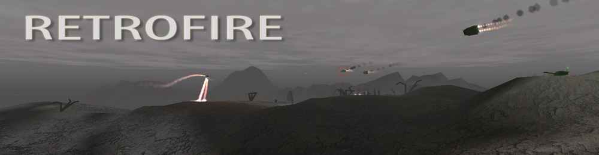

# Retrofire 1.3.1

Copyright 2007-2023 gadz.pl

https://gadz.pl

Created by Grzegorz Drozd

# Website

The 'Retrofire' website is available at https://gadz.pl/retrofire
You can download working game there, find some videos, screenshots, descriptions etc.

I also uploaded this game to https://itch.io and there you'll find more information about the game in English. It's here: https://gadzombie.itch.io/retrofire .

A video gameplay is here: https://www.youtube.com/watch?v=cAQn5bIUaSs

# Introduction

This game was created in 2007 and complete. But in 2023 I found it, upgraded a lot and at the same time I made it open-source and put it on GitHub. So current version has many improvements in code, gameplay, works smoother, has less levels and is much easier. The older game was a bit too hard and too long.

# Compilation

Retrofire was created in Borland Delphi by Borland International Inc./Embarcadero Technologies, Inc.

Current version is compiled in Delphi 11 Community, the sources are upgraded to be compatible with this version of Delphi. The game after compilation may run on Windows 7 to 11. I tested it on Windows 10. I didn't try it on Win11, but I'm almost sure it will work too.

Also, I used some third party libraries and components. I shouldn't redistribute it because it's not my property. But all of them are free and I used very old versions (it was almost 20 years ago!). So it's almost impossible to find today these components in used here old versions. That's why I decided to add these components into my repository, to give someone a possibility to just compile the code. All of them has descriptions with copyrights, licences and authors, if it was mentioned in included files. Some parts of these components are changed by me because I needed it.

So... if you're an author of any of these components and you think I should remove it from this repo, please send me a message and I will do it immediately. I don't want to steal your work, I didn't earn a single penny on this game. All my games are freeware.

All needed source files should be included in this repositiory. Main file to start is `Retrofire.dpr`. There are also additional tools in separate folders.

## Third party components

- FMOD
  
    Version 3.73
              
    Copyright (c) Firelight Technologies Pty, Ltd,    

    It's a bit modified to let it compile in a newer versions of Delphi.
  
- PowerDraw v3.0 Pre-Release 3
  
    Written by Lifepower (lifepower@fromru.com)

    This one is edited by me. I adapted it to a bit newer version of Delphi and added some fixes. I don't have the original sources :(

    I included a zipped folder with all files I had from this library. You should unzip it and include to the project.

# The code

This is a Polish game. The code is not top quality, I know it. Almost all variable and type names are Polish, so it could be hard to understand for foreigners. You'll see also there is a big mess in the code, ugly formatting etc. Sorry, it was my fault. 

The current code is reformatted and fixed. It still is not the best, but it is better than before.

# The purpose of this repositiory

Do what do you want with this code. Maybe you'll learn, maybe have fun. Maybe you'll fix something or change. The only thing I wouldn't like you to do is changing the credits for my game and release it anywhere. Please, keep in mind, it was my game and I sacrificed many months of work on it. And it all was always free. I deserve credit for this game and this code. Even if it's not the best quality. Thanks.

Grzegorz "GAD" Drozd, vel GadZombie
